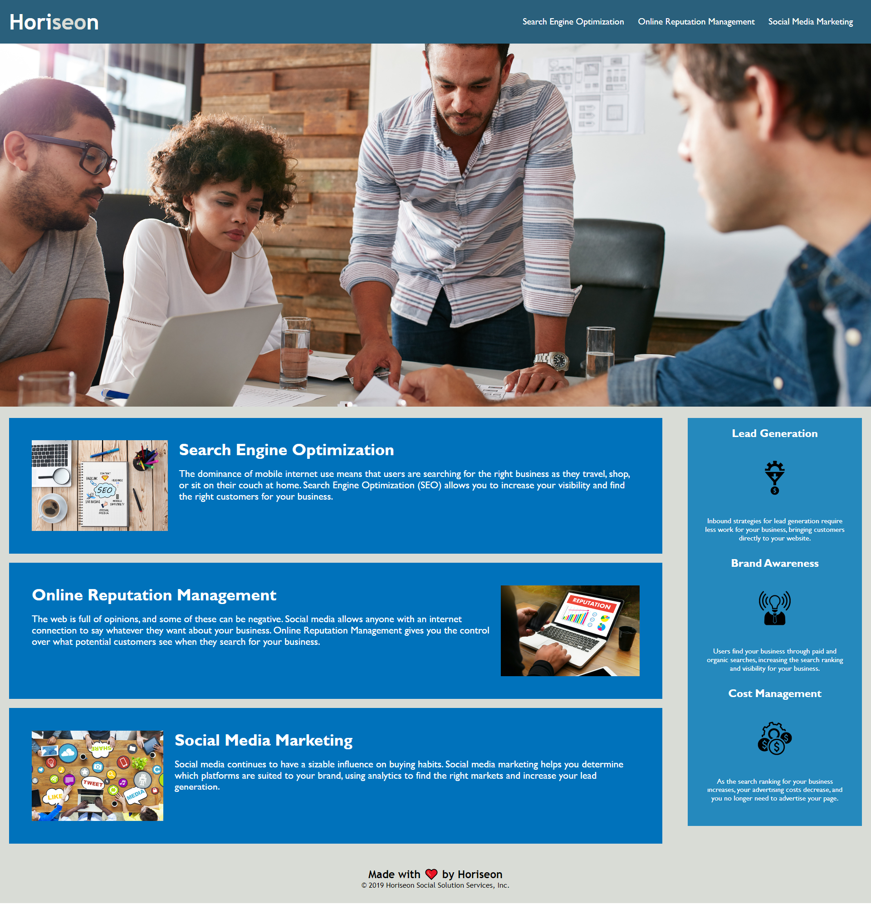

# Title

## Table of Contents
1. [Description](#description)
2. [Usage](#usage)
3. [Visuals](#visuals)

## Description
For this challenge, I refactored the HTML and CSS of the starter code to cut down on the use of extraneous attributes and elements in the HTML code and redundant stylings in the CSS code. Additionally, I added metadata and modified some of the HTML to improve the search engine optimization. Lastly, I made some slight modifications to the CSS to improve visual readability of the text content. If I were to make further improvements I would change the block displays to flexbox to make the webpage responsive and mobile-friendly.

## Usage

## Visuals

